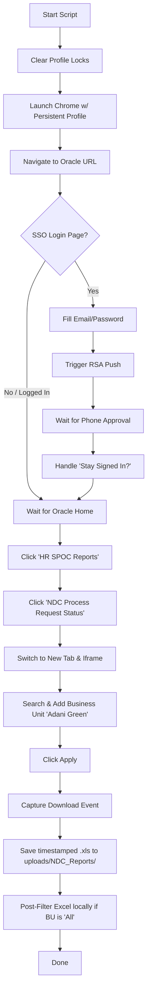

# Oracle Fusion - NDC Process Request Status Report Downloader

This project automates the extraction and download of the Oracle BI Publisher report: **`NDC Process Request Status(NDC Assigned Date)`**.

It utilizes **Playwright** in Python to handle the navigation, automate Microsoft SSO login, manage MFA/RSA push notifications, select the target Business Unit, and download the report file.

---

## Features

- **Automated Authentication**: Automatically fills email and password credentials for Microsoft SSO.
- **MFA/RSA Push Handling**: Detects MFA requests and prompts the user to approve the push notification on their phone.
- **Session Persistence**: Saves the browser session state in `chrome_automation_profile/` so that subsequent runs do not require logging in or completing MFA again until the session expires.
- **Dynamic UI Navigation**: Handles Oracle Fusion springboard, handles nested BI Publisher iFrames, searches and assigns Business Units (e.g., `Adani Green`), and triggers automated Excel downloads.
- **Local Excel Post-Filtering**: Automatically filters downloaded Oracle Excel sheets to keep only rows starting with "Adani Green" if the report was downloaded with "All" Business Units.
- **F&F Exit Document Extraction**: Automates searching and downloading F&F PDF exit documents from OpenText Content Server, skipping irrelevant directories.
- **Dedicated SharePoint Syncing**: Uploads the latest NDC Excel files to SharePoint (keeping only the latest file) and recursively uploads F&F PDFs to their respective employee folders.
- **Smart Retries & Error Handling**: Implements retry logic for SSO pages and automatically clears Chrome lock files before starting.

---

## File Structure

```
NDC-Tracking-Automation/
├── scripts/
│   ├── download_ndc_report.py       ← Downloads report from Oracle Fusion
│   ├── download_f&f_report.py       ← Downloads F&F exit documents (interactive/on-demand)
│   └── upload_to_sharepoint.py      ← Uploads Excel and F&F documents to SharePoint
├── scheduler/
│   ├── run_pipeline.py              ← Orchestrator: runs daily NDC download → upload
│   └── setup_scheduler.ps1          ← ONE-TIME setup: registers 4 daily scheduled tasks
├── uploads/                         ← Downloaded files saved here
│   ├── NDC_Reports/                 ← Downloaded NDC Excel sheets
│   └── FF_Reports/                  ← F&F PDF documents in employee ID subfolders
├── logs/                            ← All runtime logs saved here
│   ├── pipeline.log
│   ├── download_ndc_report.log
│   └── upload_to_sharepoint.log
├── chrome_automation_profile/       ← Persistent Chrome session (keeps you logged in)
├── pyproject.toml                   ← Project dependencies
├── .env                             ← Credentials (git-ignored)
└── .env.sample                      ← Credentials template
```

---

## Prerequisites

1. **Python 3.12+**
2. **Google Chrome** installed on the host machine (the script uses the official Chrome channel for automation).
3. **[uv](https://github.com/astral-sh/uv)** (recommended Python package manager) or standard `pip`.

---

## Setup & Installation

### Step 1: Configure Environment Variables
Copy `.env.sample` to a new file named `.env`:
```powershell
copy .env.sample .env
```
Open `.env` and fill in your details:
- **Oracle Fusion configuration**:
  - `ORACLE_URL`: The Oracle Fusion URL.
  - `ORACLE_EMAIL`: Your corporate login email.
  - `ORACLE_PASSWORD`: Your corporate login password.
  - `HEADLESS`: Set to `true` for background runs or `false` to watch the browser in action.
- **SharePoint configuration**:
  - `SHAREPOINT_TENANT_ID`: The SharePoint Tenant ID.
  - `SHAREPOINT_SITE_URL`: The SharePoint site URL.
  - `SHAREPOINT_CLIENT_ID`: App Registration Client ID with API access.
  - `SHAREPOINT_CLIENT_SECRET`: App Registration Client Secret.
  - `SHAREPOINT_TARGET_FOLDER`: Server relative folder path (e.g., `/sites/AGEL-Automation/Shared Documents/AI_AGEL/001_AI_Project/AI05_NDC_Tracker`).

### Step 2: Install Dependencies
It is highly recommended to use `uv` for package management:

```powershell
# Install project dependencies
uv sync

# Install Playwright browser binaries
uv run playwright install chromium
```

*(Optional)* If you prefer standard `pip` and `venv`:
```powershell
python -m venv .venv
.venv\Scripts\activate
pip install -r pyproject.toml
playwright install chromium
```

---

## Usage

### 1. Download the Report
Run the automation script to download the report from Oracle Fusion:

```powershell
uv run scripts/download_ndc_report.py
```

- **Headless Mode (Background)**: Set `HEADLESS=true` in `.env` to run the browser in the background.
- **Headed Mode (Visual)**: Set `HEADLESS=false` in `.env` to open the browser window and watch the interactions.

> [!NOTE]
> If a login session expires and MFA is triggered, the script will wait up to **5 minutes** for you to approve the push notification on your mobile device. Once approved, it will automatically continue.

### 2. Run F&F Exit Documents Downloader
Run the F&F Exit Document Downloader manually by providing a list of employee IDs:

```powershell
uv run scripts/download_f&f_report.py
```
- The script will ask you to enter employee IDs (comma-separated or one-by-one).
- It will automatically search OpenText Content Server, skip irrelevant folders (e.g., `ServiceNow Request`), and download all F&F PDF documents into `uploads/FF_Reports/<Employee_ID>/`.

### 3. Upload to SharePoint
Upload the downloaded reports to SharePoint. You can run individual uploads for NDC reports or F&F documents:

```powershell
# Upload only the latest NDC report (cleans up older reports in SharePoint automatically)
uv run scripts/upload_to_sharepoint.py --type ndc

# Upload all downloaded F&F exit documents recursively under their employee ID folders
uv run scripts/upload_to_sharepoint.py --type ff
```

---

## Automated Scheduling

The pipeline schedules run automatically every day:
- **NDC Pipeline**: Runs at **10:00, 13:00, 16:00, and 19:00**
- **F&F Pipeline**: Runs at **10:15, 13:15, 16:15, and 19:15**

If the PC was off or asleep at trigger time, missed tasks run automatically on the next boot/wake.

---

### ▶ Setup — Run Once Per Machine

Open **PowerShell or CMD** and run:

```cmd
cd "C:\Projects\NDC-Tracking-Automation"
powershell -ExecutionPolicy Bypass -File scheduler\setup_scheduler.ps1
```

> [!NOTE]
> Works in **both PowerShell and CMD** — no Administrator access required.

---

### 🔍 Verify — Check Tasks Are Active

Run after setup **or after every restart** to confirm all 8 tasks are alive:

**PowerShell:**
```powershell
Get-ScheduledTask -TaskName "*_Pipeline_*" | Select-Object TaskName, State
```

**CMD:**
```cmd
schtasks /Query /FO TABLE | findstr "Pipeline"
```

✅ Expected output — all 8 tasks must show `Ready`:
```
TaskName           State
FNF_Pipeline_1015  Ready
FNF_Pipeline_1315  Ready
FNF_Pipeline_1615  Ready
FNF_Pipeline_1915  Ready
NDC_Pipeline_1000  Ready
NDC_Pipeline_1300  Ready
NDC_Pipeline_1600  Ready
NDC_Pipeline_1900  Ready
```

---

### ⏸ Stop / Disable — Pause Without Deleting

Use this when you want to **temporarily stop** a pipeline (e.g. during maintenance).
Tasks remain registered — just won't fire until re-enabled.

**PowerShell:**
```powershell
Get-ScheduledTask -TaskName "*_Pipeline_*" | Disable-ScheduledTask
```

---

### ▶ Re-Enable — Resume After Stopping

**PowerShell:**
```powershell
Get-ScheduledTask -TaskName "*_Pipeline_*" | Enable-ScheduledTask
```

---

### 🗑 Remove — Permanently Delete Tasks

Use this to **completely unregister** all NDC and F&F tasks from Windows.
You will need to run `setup_scheduler.ps1` again to restore them.

**PowerShell or CMD:**
```cmd
powershell -ExecutionPolicy Bypass -File scheduler\setup_scheduler.ps1 -Uninstall
```

---

### 📋 Check Logs After a Run

```cmd
notepad logs\pipeline.log
```

---

### How Tasks Behave

| Scenario | Result |
|---|---|
| PC ON at trigger time | ✅ Runs silently at exact time |
| PC OFF/asleep at trigger time | ✅ Runs automatically on next boot/wake |
| Windows Lock Screen (`Win + L`) | ✅ Runs normally (PC is still on) |
| Sleep mode / Lid closed | ✅ Runs on wake |

> [!NOTE]
> Tasks are **permanently stored in Windows** — they survive restarts, updates, and sleep.
> Re-run `setup_scheduler.ps1` only if the project folder is moved or Windows is reinstalled.


---

## How It Works Under the Hood



1. **Clean Profile Locks**: The script cleans any leftover Chrome lock files (e.g. `SingletonLock`) to prevent browser launch issues.
2. **Persistent Context**: Uses `chrome_automation_profile/` to keep you logged in across multiple script executions.
3. **Microsoft SSO & RSA MFA**: Automates credential input and handles MFA push verification. If the login session is rejected/retried, it clicks "Retry" up to 3 times.
4. **Oracle Navigation**: Opens the report portal and handles nested iframe elements.
5. **Business Unit Selection**: Automates the modal search dialog to search for `"Adani Green"`, moves all matching search results to the selected panel, and submits the parameter dialog.
6. **Download & Post-Filter**: Triggers and saves the report to the `uploads/NDC_Reports/` folder, naming it with a timestamp. If Oracle fails to restrict the Business Unit to "Adani Green" (returning "All" instead), a local post-filter automatically runs to clean the sheet and keep only the Adani Green rows.

---

## Troubleshooting

### Browser Fails to Start (Lock Files)
If the script crashed previously, Chrome might leave lock files behind. While `download_ndc_report.py` attempts to delete these automatically, you can manually delete the `chrome_automation_profile/SingletonLock` file if the browser fails to initialize.

### MFA Timeout
If you miss the push notification on your phone, the script will timeout after 5 minutes. Simply run the script again.

### Customizing the Business Unit
Currently, the Business Unit search term is set to `"Adani Green"`. To download reports for a different Business Unit, edit the `BUSINESS_UNIT_SEARCH` variable inside `download_ndc_report.py`:
```python
BUSINESS_UNIT_SEARCH = "Your Business Unit Name"
```
