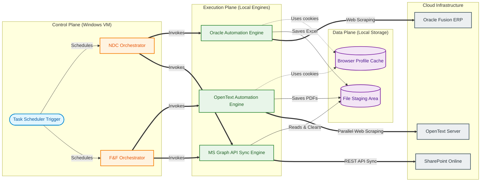
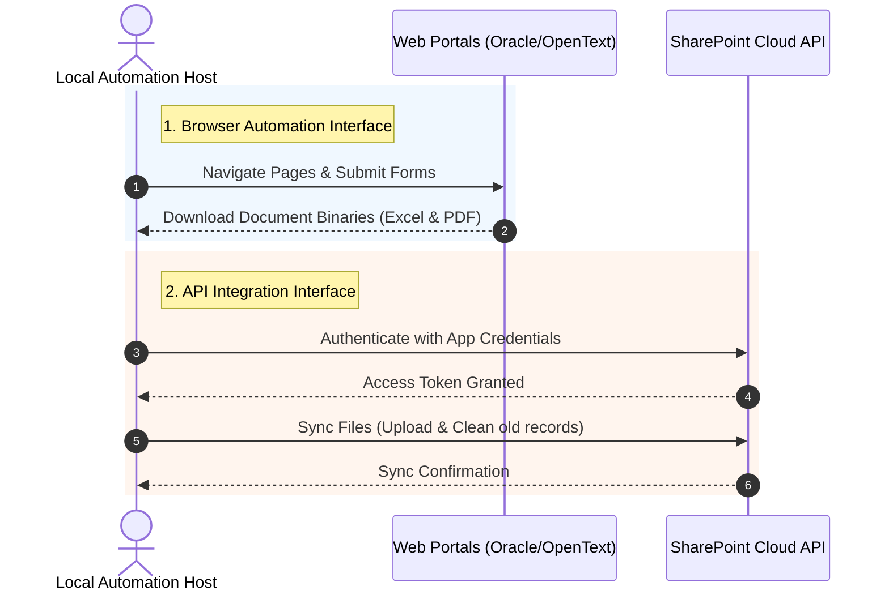
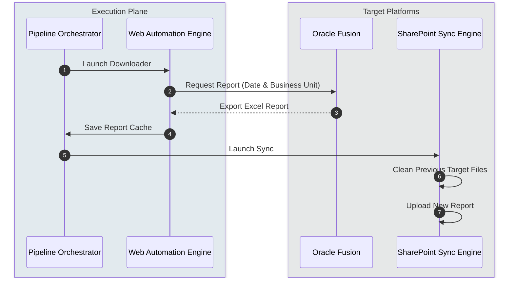
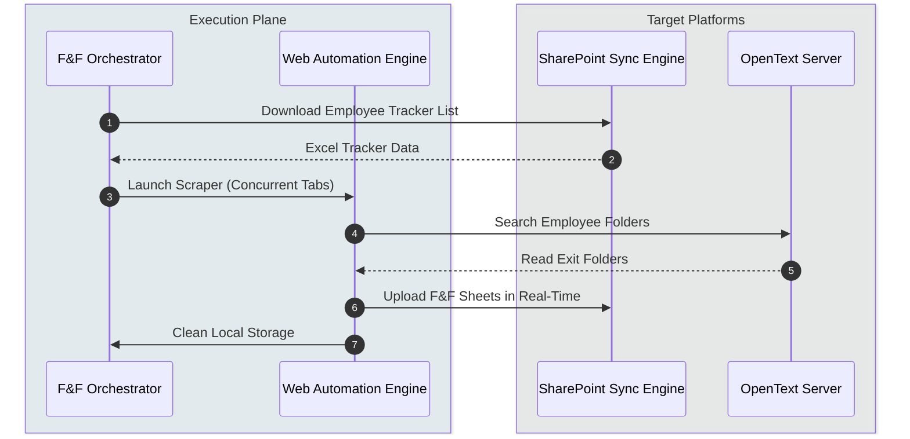
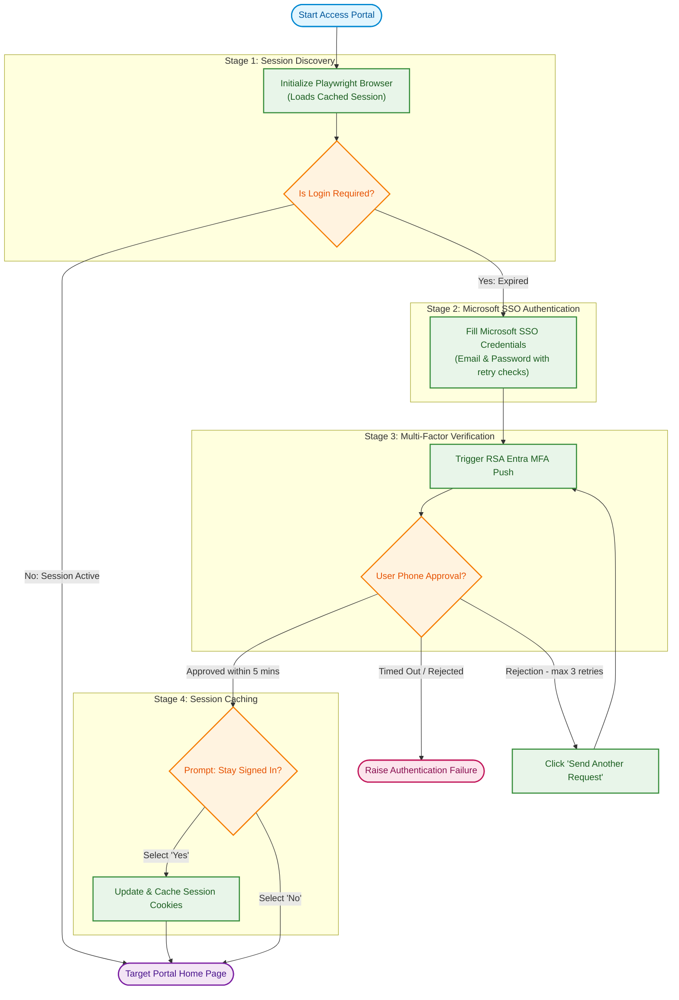

# System Architecture Blueprint: Enterprise Reporting & F&F Automation

This document provides a single, unified reference for the software architecture, component details, data flows, operational workflows, scheduling, and troubleshooting procedures of the Oracle Fusion and OpenText Content Server automation system.

---

## 1. High-Level System Architecture

The automation system runs on a local Windows host machine (VM). It integrates three primary enterprise platforms: **Oracle Fusion ERP**, **OpenText Content Server**, and **Microsoft SharePoint Online**. It acts as a bridge, utilizing browser automation, local data processing, and cloud APIs to sync employee reports and exit documents.

### System Component Map
The block diagram below displays the clean conceptual layers and data flows of the system:



---

## 2. Core Modules & Directory Layout

The codebase uses a modular layout to isolate automation steps from API execution and scheduling tasks.

* **Orchestration**: Directs the flow of execution, triggering the download of reports, reading local parameters, and initiating the upload tasks.
* **Web Automation**: Controls the browser channel to bypass authentication portals, input parameters (such as Dates and Business Units), and download files.
* **SharePoint Sync**: Manages cloud storage, directory resolution, and token exchange.

---

## 3. Data Integration Interfaces

The system uses different integration types depending on the security requirements and API support of each target platform:



1. **Browser Automation**: Interacts with user interface elements. It maintains cached browser profiles to reuse valid session cookies and avoid triggering authentication challenges on every execution.
2. **API Interface**: Authenticates via MSAL and uploads files in chunks to ensure reliability on corporate networks.
3. **Local File Operations**: Cleans local caches upon successful upload to ensure data security.

---

## 4. Key Workflows & Scenarios

### Scenario A: Daily NDC Ingestion Workflow
This scenario automates report generation from Oracle Fusion and uploads it to SharePoint.



#### Local Filtering Fallback
If the Oracle report engine ignores the requested parameters and exports a complete list of all Business Units, the system applies a local post-download filter. It parses the spreadsheet, isolates the target records (such as those starting with the required Business Unit prefix), updates the report metadata, and saves the filtered output.

---

### Scenario B: F&F Active Processing Workflow
This workflow processes exit documents by reading employee trackers from SharePoint, scraping OpenText, and syncing the documents.



#### Document Naming Filter
The system inspects files inside the target directories and filters them to ensure it only extracts the actual exit calculations. It evaluates file names using a case-insensitive match for variations of exit abbreviations (such as "F&F", "F and F", "FNF", or "Full and Final"), skipping other document types like Relieving or Experience Letters.

#### Real-Time Transactional Sync
To optimize performance and minimize local storage usage, the F&F engine runs a transactional callback. As documents are downloaded, the system uploads them to SharePoint immediately and deletes the local files. This ensures that progress is saved in real-time.

---

### Scenario C: Microsoft SSO & RSA MFA Authentication
Both engines use a shared login handler to authenticate with Microsoft Entra ID.



---

## 5. Operations & Scheduling

The system uses Windows Task Scheduler to run in the background. The schedules are registered under the local user's account session using the provided PowerShell script.

### Automated Task Schedules
* **NDC Report Sync**: `10:00`, `14:00`, and `18:00`.
* **F&F Document Sync**: `11:15` and `16:30`.
* **Windowless Execution**: The system executes scripts in windowless mode (`pythonw.exe`), preventing command prompt windows from interrupting the user.

### How to Setup the Scheduler Pipeline
The setup process registers the automated background triggers directly into Windows.

1. **Open PowerShell**: Launch PowerShell in the project root directory. No administrator privileges are required.
2. **Execute Setup Script**: Run the following command to register all tasks:
   ```powershell
   powershell -ExecutionPolicy Bypass -File scheduler\setup_scheduler.ps1
   ```
3. **Verify Registration**: Confirm the tasks are active by running:
   ```powershell
   Get-ScheduledTask -TaskName "*_Pipeline_*" | Select-Object TaskName, State
   ```
   You should see all tasks listed with the state `Ready`.
4. **Maintenance Commands**:
   - Pause schedules: `Get-ScheduledTask -TaskName "*_Pipeline_*" | Disable-ScheduledTask`
   - Resume schedules: `Get-ScheduledTask -TaskName "*_Pipeline_*" | Enable-ScheduledTask`
   - Uninstall all: `powershell -ExecutionPolicy Bypass -File scheduler\setup_scheduler.ps1 -Uninstall`

---

## 6. Corporate Proxy & Network Configurations

Many corporate networks use firewalls that inspect SSL traffic. The system handles this using the following settings:

* **SSL Verification Controls**: The system disables SSL validation check parameters in its authentication client and HTTPX request sessions, and silences warnings from Python's network libraries.
* **Browser Security Evasions**: The browser starts with configuration arguments that disable automation flags so login portals do not block the browser.

---

## 7. Operational Troubleshooting

### Problem 1: Browser Fails to Open
* **Cause**: The browser crashed during a previous run and left profile lock files on disk.
* **Resolution**: Terminate all active browser processes using the Windows Task Manager, then delete the lock files in the chrome automation profile directory.

### Problem 2: Authentication Timeout or MFA Rejection
* **Cause**: Session cookies have expired, or the user did not approve the mobile push notification.
* **Resolution**: Run the download script in headed mode. This opens the browser window so you can input credentials, approve the MFA prompt, and check the "Stay signed in" box to save new cookies.

### Problem 3: Exit Documents are Not Being Synced
* **Cause**: The documents do not match the expected naming criteria.
* **Resolution**: Check the file names in the target server. If the files do not use the typical exit abbreviations, update the naming pattern matches in the configuration file.

---

## 8. Security & Scaling Architecture

### Data Privacy (PII Protection)
The F&F (Full & Final) exit documents contain sensitive Personally Identifiable Information (PII) including financial calculations. To comply with data privacy standards, the system implements a **Transactional Sync** mechanism. As soon as a document is securely uploaded to SharePoint via HTTPS, the local file and its parent staging directory are immediately and permanently deleted from the VM disk. No employee records remain in local caches after a successful execution.

### Resiliency & Thread Scaling
To prevent server memory overload and ensure the host VM remains stable, the OpenText scraping engine uses a semaphore-limited thread pool. 
* **Tab Limitation**: A maximum of `5` concurrent Playwright tabs are permitted at any given time.
* **Auto-Recovery**: If a script terminates unexpectedly, the `pipeline orchestrator` automatically detects and deletes orphaned `SingletonLock` files inside the `chrome_automation_profile` to guarantee the browser can launch cleanly on the next scheduled run.

---

## 9. One-Step End-to-End Execution

To run the entire automation suite (both NDC and F&F pipelines) manually in a single step, you can execute both orchestrators sequentially. 

Open a terminal in the project root and run:

```powershell
uv run scheduler/run_pipeline.py ; uv run scripts/process_fnf_closed_reports.py
```

**What this does in one step:**
1. Triggers the Oracle Playwright automation to download and filter the NDC report.
2. Automatically syncs the NDC report to SharePoint via Graph API.
3. Immediately starts the F&F active tracker processor.
4. Spawns parallel Playwright tabs to extract exit documents from OpenText and syncs them to SharePoint.
5. Cleans up all local temporary files leaving the system in a clean state.

---

## 10. Client Environmental Dependencies & Limitations

> [!WARNING]
> **Important Client Responsibilities:** This automation suite executes **directly on the client's local machine** (or dedicated VM). It does not run in a managed cloud environment. As such, it is strictly dependent on the client's host environment. Environmental failures are **not software bugs** and are the responsibility of the system administrator to maintain.

The following strict operational dependencies apply:

1. **Host Machine Must Be Powered On**: If the client's machine or VM is shut down, powered off, or disconnected from the internet during a scheduled trigger time, the automation **will not work**. 
2. **Mandatory Password Updates**: The system relies on the Microsoft SSO credentials stored locally in the `.env` configuration file. **If the client changes their corporate Microsoft password, they MUST manually update the `.env` file**. Failure to update the password will result in authentication lockouts. This is a client operations requirement, not a developer error.
3. **Active Portal Access**: The system relies on the client's active directory account having valid permissions. If portal access to Oracle Fusion, OpenText, or SharePoint is revoked, expired, or blocked by a corporate VPN change, the pipeline will fail until access is restored.
